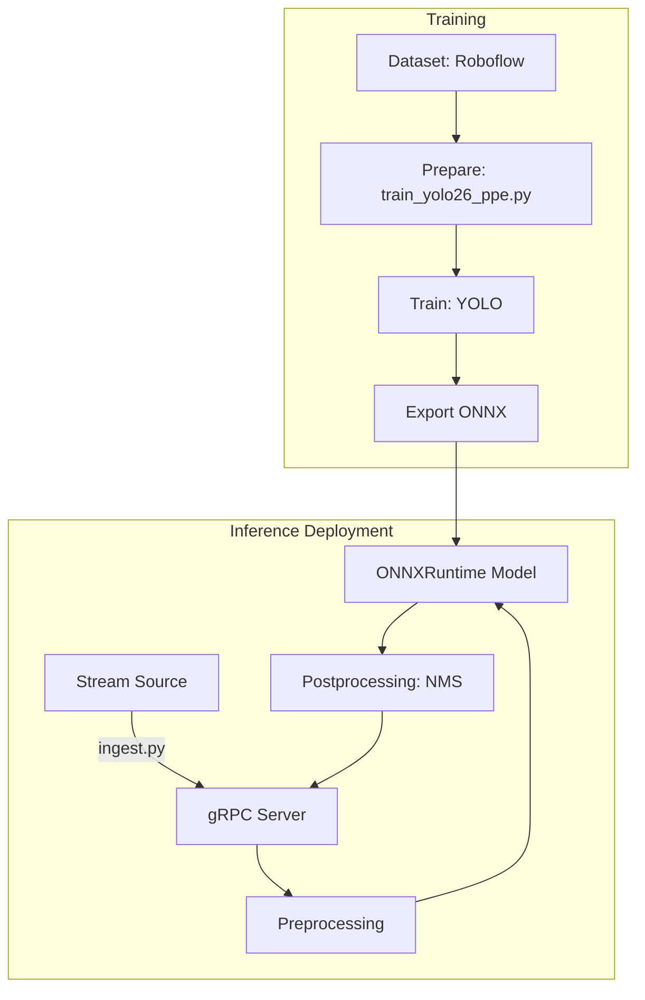

### A. Executive Summary

- **Mục tiêu và kiến trúc dự án:** Dự án phát triển hệ thống phát hiện đồ bảo hộ lao động (PPE - Personal Protective Equipment) với 5 class: helmet, no_helmet, vest, no_vest, person. Hệ thống sử dụng mô hình YOLO26s (có vẻ là Ultralytics YOLO11 hoặc tương tự được đổi tên) được huấn luyện trên Kaggle, sau đó xuất ra ONNX (FP32, FP16) và triển khai thông qua gRPC microservice cùng FastAPI. Data pipeline cho inference bao gồm image scaling/padding theo chuẩn YOLO, infer qua ONNXRuntime và post-processing bằng NMS của OpenCV.
- **Đánh giá tổng thể:** Kiến trúc có thiết kế bài bản với sự tách bạch giữa training, inference, batch ingestion và deployment thông qua Docker. Tuy nhiên, tồn tại **lỗi cực kỳ nghiêm trọng về rò rỉ dữ liệu (data leakage) trong quá trình huấn luyện**, khiến cho mọi metric hiện tại đều vô giá trị. Khâu inference cũng chứa sai sót trong việc chọn hàm NMS gây ảnh hưởng độ chính xác.
- **Các rủi ro nghiêm trọng nhất:**
  - Data leakage do shuffle toàn bộ tập dữ liệu trước khi cắt train/val (phá vỡ cấu trúc của dataset gốc).
  - Lỗi Class-agnostic NMS có thể làm mất dự đoán đúng khi các objects thuộc các class khác nhau bị chồng lấn (VD: person & vest).
  - Không có đánh giá độc lập trên tập test (test set bị bỏ qua).
- **Mức độ sẵn sàng:** Prototype. Yêu cầu huấn luyện lại từ đầu và vá lỗi pipeline trước khi dùng cho Staging/Production.

### B. Repository Architecture

- **Thành phần chính:**
  - `models/kaggle/train_yolo26_ppe.py`: Script huấn luyện mô hình.
  - `export_accelerated.py`: Script xuất mô hình ONNX/Engine.
  - `inference_service/`: Server gRPC phục vụ inference.
  - `app/`: Các modules xử lý pre/post-processing, load model và FastAPI endpoints.
  - `stream_ingestion/`: Client đẩy video frame liên tục vào gRPC.
- **Entry points:**
  - Training: `models/kaggle/train_yolo26_ppe.py`
  - FastAPI: `app/main.py`
  - gRPC Server: `inference_service/server.py` & `server_accelerated.py`
  - Ingestion: `stream_ingestion/ingest.py`
- **Luồng xử lý (Mermaid Flow):**


### C. Findings

#### [F-01] Rò rỉ dữ liệu (Data Leakage) nghiêm trọng do chia sai split
- Severity: Critical
- Confidence: High
- Category: Data / Training
- Location: `models/kaggle/train_yolo26_ppe.py:338-353`
- Evidence: Code gom toàn bộ ảnh từ `find_images(dataset_root)`, thực hiện `random.Random(SEED).shuffle(images)` rồi cắt 85% đầu làm `train` và 15% làm `val`.
- Problem: Dataset gốc từ Roboflow (construction-safety-gsnvb v1) đã có cấu trúc train/val/test rành mạch. Việc trộn toàn bộ ảnh và chia lại theo tỉ lệ ngẫu nhiên làm rò rỉ dữ liệu (ảnh từ tập test, val có thể lẫn vào train).
- Why it matters: Mô hình "học thuộc" tập validation, dẫn đến metrics cao giả tạo (validation precision, recall, mAP) nhưng sẽ hoạt động cực tệ trong thực tế.
- Failure scenario: Model đạt >0.9 mAP lúc train nhưng gặp dữ liệu demo mới sẽ có độ chính xác thấp.
- Recommended fix: Sử dụng trực tiếp file `data.yaml` gốc của Roboflow và đường dẫn mặc định thay vì gom ảnh và tự chia lại. Sửa script để skip khâu `prepare_dataset` nếu `USE_EXISTING_DATA_YAML=true`.
- Validation method: Bỏ hàm shuffle và check log training để đảm bảo tập val/test giữ nguyên.
- Estimated effort: Medium

#### [F-02] Post-processing sử dụng NMS không phân biệt class (Class-agnostic NMS)
- Severity: High
- Confidence: High
- Category: Inference / Performance
- Location: `app/postprocessing.py:73`
- Evidence: Sử dụng `cv2.dnn.NMSBoxes(bboxes=boxes, scores=scores, ...)`
- Problem: OpenCV `cv2.dnn.NMSBoxes` thực hiện NMS mà bỏ qua class_ids. Nếu một `person` và `vest` chồng lấp nhau với IOU > ngưỡng (0.45), bounding box có confidence thấp hơn sẽ bị xóa bỏ.
- Why it matters: Trong bài toán PPE, vest/helmet luôn chồng lấp với person. Model sẽ bị mất dự đoán nghiêm trọng.
- Failure scenario: Người mặc áo vest được model nhận diện là `person` (conf 0.9) và `vest` (conf 0.85). NMSBoxes xóa mất `vest`.
- Recommended fix: Chuyển sang sử dụng `cv2.dnn.NMSBoxesBatched(bboxes, scores, class_ids, score_threshold, nms_threshold)` để thực hiện class-aware NMS.
- Validation method: Gửi ảnh có person mặc vest, kiểm tra kết quả trả về đủ cả 2 bbox.
- Estimated effort: Small

#### [F-03] Không đánh giá (evaluate) trên Test Set
- Severity: High
- Confidence: High
- Category: Evaluation
- Location: `models/kaggle/train_yolo26_ppe.py:401`
- Evidence: Hàm `trained_model.val(...)` chỉ chạy đánh giá trên validation set. Không có script hay bước nào thực thi model trên test set riêng.
- Problem: Không thể xác minh tính khái quát hoá (generalization) của mô hình.
- Why it matters: Cùng với lỗi Data Leakage, chất lượng mô hình đang bị thổi phồng hoàn toàn.
- Failure scenario: Người dùng tin vào metrics từ `model_metadata.json` để đưa lên production nhưng kết quả tệ.
- Recommended fix: Thêm bước đánh giá mô hình bằng `trained_model.val(split='test', ...)` trong training pipeline.
- Validation method: Kiểm tra log của training pipeline để đọc metrics trên tập test.
- Estimated effort: Small

#### [F-04] Lỗi thiếu dependencies trong Test Suite khiến pytest thất bại
- Severity: Medium
- Confidence: High
- Category: Maintainability / Testing
- Location: `requirements-dev.txt` / `tests/test_benchmark.py:3`
- Evidence: Chạy `pytest tests/` failed do thiếu `cv2`, `numpy` trong environment nếu chỉ cài `requirements-dev.txt` mà chưa cài `requirements.txt`. Tuy nhiên, ngay cả khi cài đủ, việc CI/CD pipeline có thể rủi ro.
- Problem: File requirements-dev.txt không include hoặc kế thừa requirements.txt, dễ gây lỗi khi setup.
- Why it matters: Giảm tính maintainable và khó khăn khi onboard.
- Failure scenario: Môi trường CI/CD chạy `pip install -r requirements-dev.txt` và `pytest` sẽ sụp đổ.
- Recommended fix: Thêm `-r requirements.txt` vào dòng đầu của `requirements-dev.txt`.
- Validation method: Chạy `pytest` ở môi trường ảo sạch chỉ cài `requirements-dev.txt`.
- Estimated effort: Small

#### [F-05] Nguy cơ Memory Leak / Crash do Batch Size lớn ở Ingestion Fallback
- Severity: Medium
- Confidence: High
- Category: Performance / Deployment
- Location: `app/main.py:276`
- Evidence: Nếu batch inference gặp exception, mã chạy `batch_predictions = [model.predict(input_tensor) for input_tensor in input_tensors]`.
- Problem: Trong gRPC (`server_accelerated.py`), nếu fallback xảy ra, mô hình dự đoán từng tensor liên tiếp. Với CPU, thread bị block thời gian dài, dễ gây gRPC timeout và memory spike.
- Why it matters: Gây gián đoạn dịch vụ khi batch có tensor bị lỗi dtype hoặc model không wrap batch đúng.
- Failure scenario: Max batch = 8, fallback diễn ra làm mất 8 * 0.7s = 5.6s, request bị timeout.
- Recommended fix: Xử lý lỗi batch nghiêm ngặt từ ONNXRuntime thay vì dùng fallback loop. Kiểm tra dynamic axis ở export.
- Validation method: Gửi request dị hình, xem log fallback và latency.
- Estimated effort: Medium

#### [F-06] Sai khác tiền xử lý Padding tọa độ khi NMS Exported Model
- Severity: Low
- Confidence: Medium
- Category: Inference
- Location: `app/postprocessing.py:34-37`
- Evidence: `x1 = (float(x1) - pad_x) / scale`.
- Problem: Mặc dù toán học bù trừ padding và scale này đúng cho letterbox của Ultralytics, nhưng việc Ultralytics export ONNX đôi khi đã bao gồm padding scaling bên trong graph nếu dùng dynamic size không đúng cách. Nếu mô hình nhận size cố định 640x640, code này đúng. Nhưng cần benchmark IoU chính xác với script PyTorch native.
- Why it matters: Bounding box có thể lệch 1-2 pixel.
- Failure scenario: Hộp dự đoán bị lệch khỏi object thực tế ở viền.
- Recommended fix: Viết parity test so sánh output của PyTorch native YOLO `.pt` và bản ONNX trên cùng 1 ảnh.
- Validation method: Chạy parity test script.
- Estimated effort: Medium

### D. Top Priority Issues

1. **[F-01] Data Leakage:** Huỷ mô hình cũ, sửa lại script để giữ nguyên train/val/test split của dataset. Huấn luyện lại mô hình từ đầu. (Ảnh hưởng cực lớn, khả năng xảy ra 100%, chi phí sửa Medium).
2. **[F-02] Class-agnostic NMS:** Thay thế `cv2.dnn.NMSBoxes` bằng `cv2.dnn.NMSBoxesBatched`. (Ảnh hưởng lớn, khả năng xảy ra cao trong PPE, chi phí sửa Small).
3. **[F-03] Thiếu Evaluation trên Test Set:** Bổ sung bước tính toán metrics trên Test Set thực sự để có cái nhìn trung thực về hiệu năng của mô hình. (Khả năng kiểm chứng cao).

### E. Model and Dataset Assessment

- **Dataset Quality & Split:** Dataset gốc là ổn, nhưng code load dataset chia split sai bét, trộn lẫn ảnh, dẫn tới leakage nghiêm trọng.
- **Annotation:** Dùng YOLO TXT format. Class `no-helmet` ở `data.yaml` khác với `no_helmet` ở config API (có logic normalize bù lại, nhưng dễ gây nhầm lẫn).
- **Model Config:** YOLO26s (có thể là alias YOLO11s). Export FP32 và FP16, chưa có INT8 (không tối ưu tối đa cho T4/Jetson).
- **Metric Reliability:** Metrics hiện tại (mAP 0.836) là hoàn toàn **không đáng tin cậy** do data leakage.
- **Generalization:** Rất thấp nếu leakage được xác nhận.
- **Deployment Gap:** Logic NMS ở code deployment chặn overlapping objects, dẫn tới dự đoán thực tế kém hơn metrics.

### F. Reproducibility Assessment

- **Khả năng tái lập:** Code có gieo `SEED=42`, nhưng việc random.shuffle() trên hệ thống files tuỳ thuộc vào thứ tự file do OS list, dẫn tới nondeterministic. Do rò rỉ dữ liệu, model train ra không thể đảm bảo kết quả trùng khớp giữa các lần chạy trên máy khác nhau.
- **Command đề xuất:**
  ```bash
  # Sửa F-01 trước
  USE_EXISTING_DATA_YAML=true python models/kaggle/train_yolo26_ppe.py
  ```

### G. Performance Assessment

- **Bottleneck hiện tại:** CPU fallback inference quá chậm (500-700ms/frame). NMS code dùng pure Python loops trên ndarray chưa được vectorization toàn phần.
- **Benchmark:** Test benchmark hiện tại (test_benchmark.py) chỉ dùng mock detector (trả về list rỗng), không bench ONNXRuntime thực tế.
- **Đề xuất tối ưu:** Vector hoá toàn bộ vòng lặp trong `postprocessing.py` sang numpy-native. Thêm TensorRT export cho môi trường Docker GPU.

### H. Test Gap Analysis

- **Test hiện có:** Unit test cơ bản cho gRPC endpoint, preprocessing mock.
- **Test còn thiếu (Top 5):**
  1. Test Data Leakage (Kiểm tra giao của tập train và test sau split).
  2. Test Parity PyTorch vs ONNX (Bắt buộc).
  3. Test NMS overlapping classes (Test với ảnh chứa người đội mũ để đảm bảo box không bị xoá).
  4. Integration test từ Image Bytes -> ONNX -> Detections đầy đủ thay vì mock.
  5. Test Performance thực tế của session ONNX trên CI.

### I. Recommended Remediation Plan

- **P0 (Sửa ngay lập tức):**
  - Sửa `models/kaggle/train_yolo26_ppe.py`: Bỏ trộn ảnh, dùng data.yaml chuẩn. Retrain model trên Kaggle.
  - Sửa `app/postprocessing.py`: Thay `cv2.dnn.NMSBoxes` bằng `cv2.dnn.NMSBoxesBatched`.
- **P1 (Trước release):**
  - Viết test parity PyTorch vs ONNX.
  - Bổ sung đánh giá Test Set trong pipeline train.
- **P2 (Cải thiện trung hạn):**
  - Vector hoá post-processing.
  - Fix requirements dependencies.
- **P3 (Tùy chọn):**
  - Cấu hình INT8 quantization.

### J. Final Verdict

- **Có lỗi làm sai kết quả hay không?** Có (NMS chặn lầm các class đè nhau).
- **Có data leakage hay không?** Có, Rất Nghiêm Trọng. Tập dữ liệu bị trộn và gán lại ngẫu nhiên.
- **Metric có đáng tin hay không?** Không.
- **Training có reproducible hay không?** Không (do OS file order + shuffle).
- **Hệ thống có sẵn sàng production hay không?** KHÔNG THỂ LÊN PRODUCTION.
- **Điều kiện bắt buộc trước khi release:** Phải huấn luyện lại với dữ liệu phân tách nghiêm ngặt, sửa class-agnostic NMS và vượt qua bài test IoU Parity giữa model gốc và ONNX.
